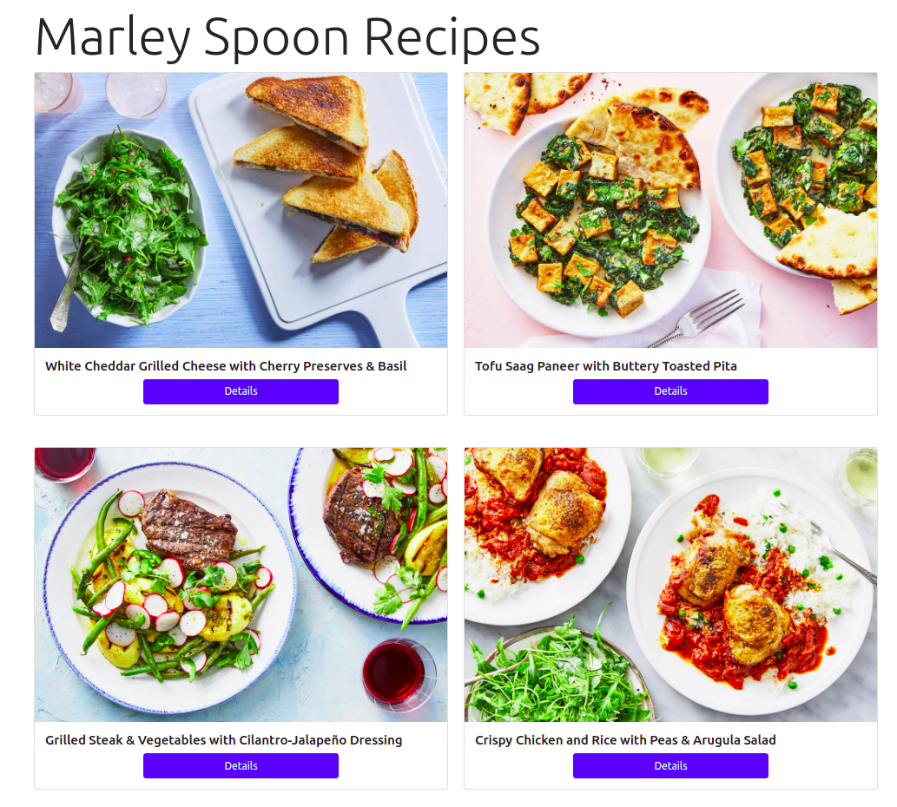
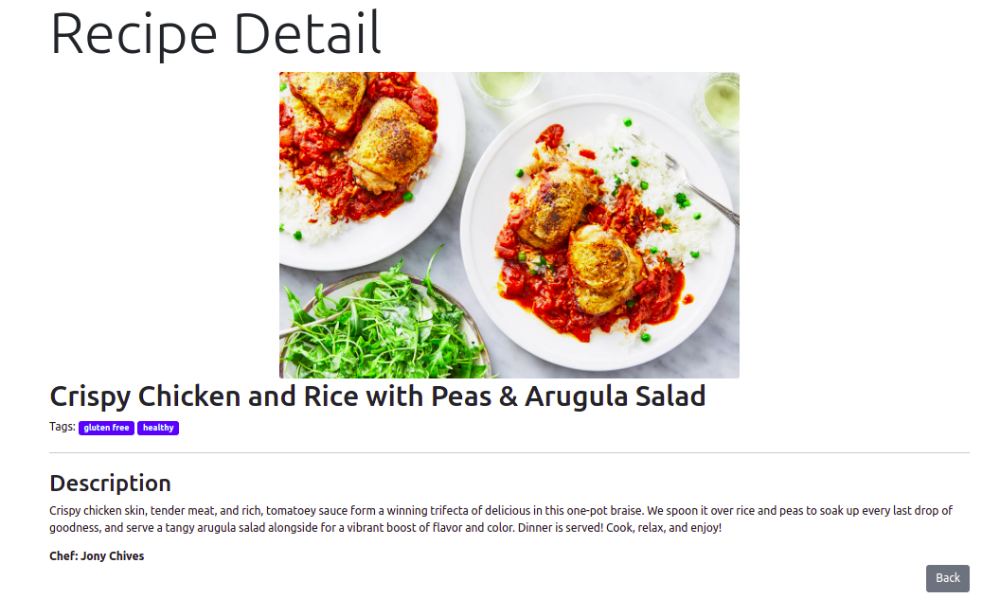

# Marley Spoon Recipes App
A Web Application that uses Contentful API to fetch Marley Spoon recipes data, written in Ruby (`v2.7.0`).

# Install
```
bundle install
```

## Gems
- `sinatra`: DSL for Ruby
- `contentful`: a client for retrieving data from the Content Delivery API 
- `dotenv`: load environmental variables
- `redcarpet`: parse Markdown to HTML
- `rubocop`: Ruby linter
- `rack-test`/`rspec`/`capybara`: testing

# Setup
Set environment variables in a `.env` file:
```
SPACE_ID=<space_id>
ACCESS_TOKEN=<access_token>
```

# Usage
```
ruby app.rb
```

# Run tests
```
rspec
```

# Screenshots

## All Recipes


## Recipe Detail
